<PageDescription>

**This Is Code Community Events** is about coding, learning and creating applications together in order to contribute to society. 

We host a variety of community events around important topics that can benefit from technology.

If you like what we do, you can sponsor our community: https://www.patreon.com/coffee_and_code
</PageDescription>

Events are held in Stockholm and Gothenburg in Sweden. Join our slack channel at http://slack.coffeencode.craftacademy.co/

**Gothenburg meetup-group** can be found here: https://www.meetup.com/coffeencodegbg/

**Stockholm meetup-group** can be found here: https://www.meetup.com/CoffeenCodeSthlm

**Anyone interested is welcome to join! It's free, and you don't have to be a developer to be able to participate. We have talks and workshops and provide food, drinks, and snacks throughout the event.**

<ImageGallery>

<ImageGalleryImage alt="This Is Code Community events" title="Community events" col={3}>

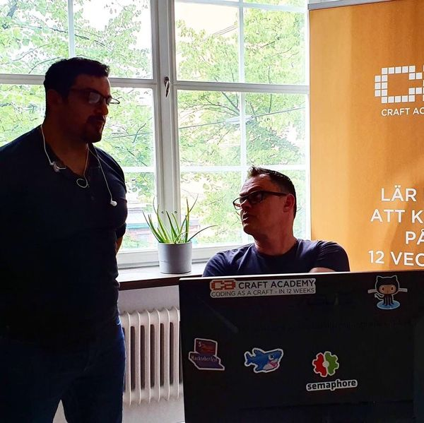

</ImageGalleryImage>
<ImageGalleryImage alt="This Is Code Community events" title="Community events" col={5}>

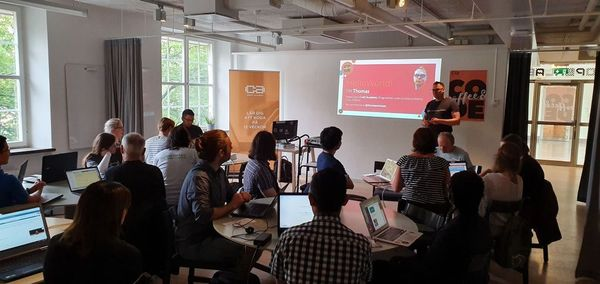

</ImageGalleryImage>
<ImageGalleryImage alt="This Is Code Community events" title="Community events" col={3}>

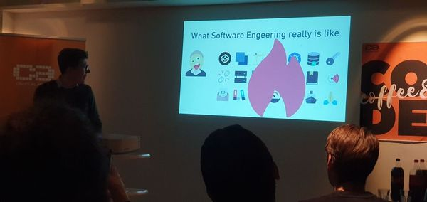

</ImageGalleryImage>
</ImageGallery>

We address issues like cyberbullying and trolling, food waste, disaster relief, etc... But it's also about learning and knowledge sharing. We invite beginners and more experienced developers to join events together and collaborate and create solutions together.
​
Based in Sweden, we organize meetups and hackathons in Stockholm and Gothenburg.

<ImageGallery>
<ImageGalleryImage alt="This Is Code Community events" title="Community events" col={6}>

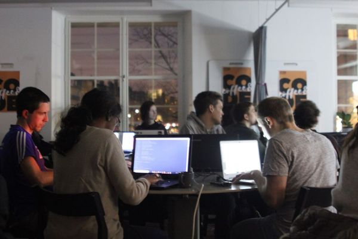

</ImageGalleryImage>
<ImageGalleryImage alt="This Is Code Community events" title="Community events" col={5}>

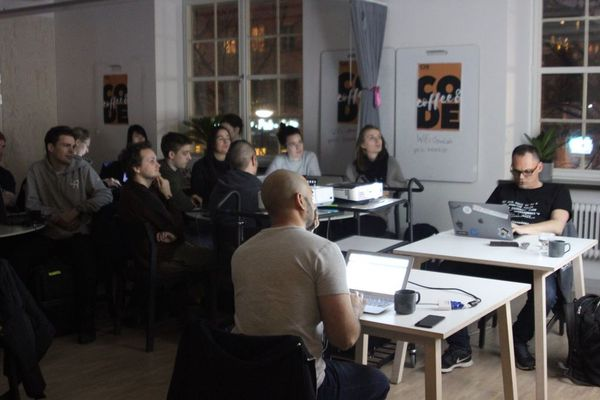

</ImageGalleryImage>
<ImageGalleryImage alt="This Is Code Community events" title="Community events" col={4}>

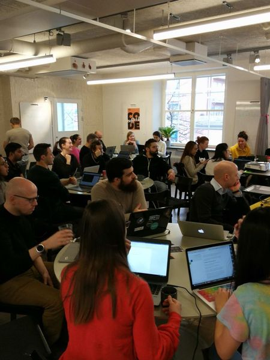

</ImageGalleryImage>
<ImageGalleryImage alt="This Is Code Community events" title="Community events" col={6}>

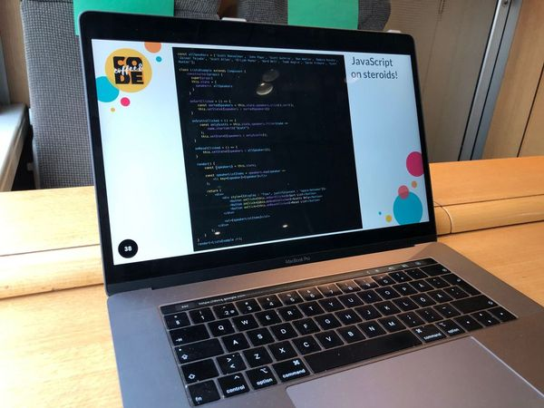

</ImageGalleryImage>

<ImageGalleryImage alt="This Is Code Community events" title="Community events" col={4}>

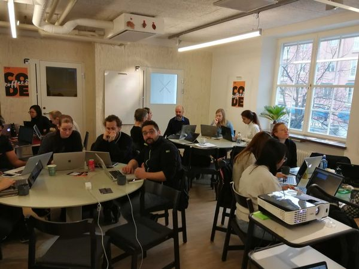

</ImageGalleryImage>
<ImageGalleryImage alt="This Is Code Community events" title="Community events" col={8}>

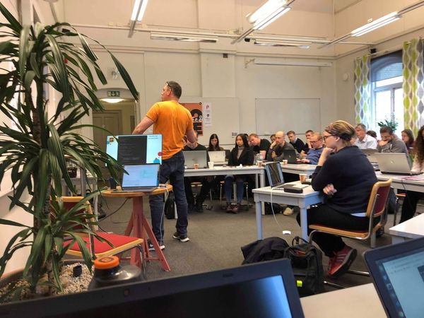

</ImageGalleryImage>
<ImageGalleryImage alt="This Is Code Community events" title="Community events" col={4}>

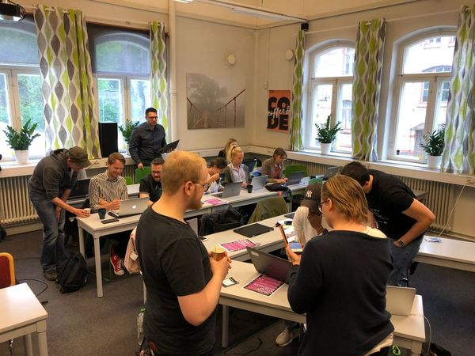

</ImageGalleryImage>
<ImageGalleryImage alt="This Is Code Community events" title="Community events" col={4}>

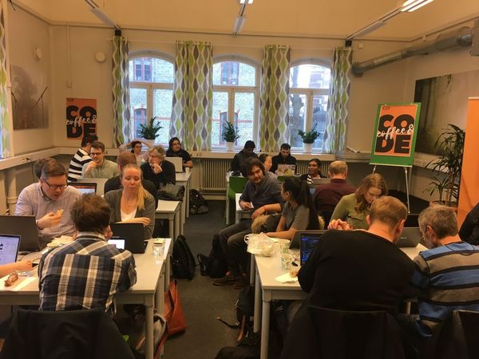

</ImageGalleryImage>
<ImageGalleryImage alt="This Is Code Community events" title="Community events" col={4}>

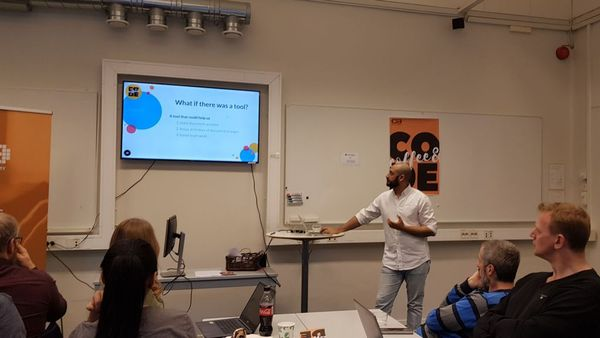

</ImageGalleryImage>
</ImageGallery>