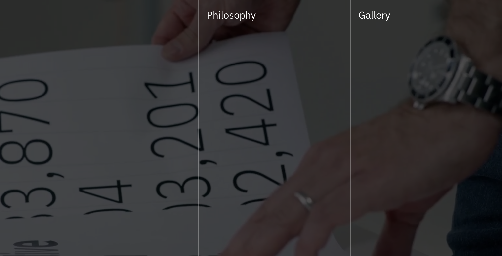

<PageDescription>

We have a multitude of sites using the gatsby theme for both public and internal sites. Using this theme we've been able to propogate features and fixes throughout the ecosystem quickly and easily.

</PageDescription>

<FeatureCard
  title="Craft Academy"
  children="Another text"
  actionIcon="arrowRight"
  href="https://craftacademy.se"
  color="light"
  >

</FeatureCard>

<FeatureCard
  title="IBM Design for AI"
  actionIcon="arrowRight"
  href="https://ibm.com/design/ai/"
  color="dark"
  >

</FeatureCard>

## IBM Design Language

<FeatureCard
  title="Test"
  actionIcon="arrowRight"
  href="https://www.ibm.com/design/language/"
  color="dark"
  >

</FeatureCard>
